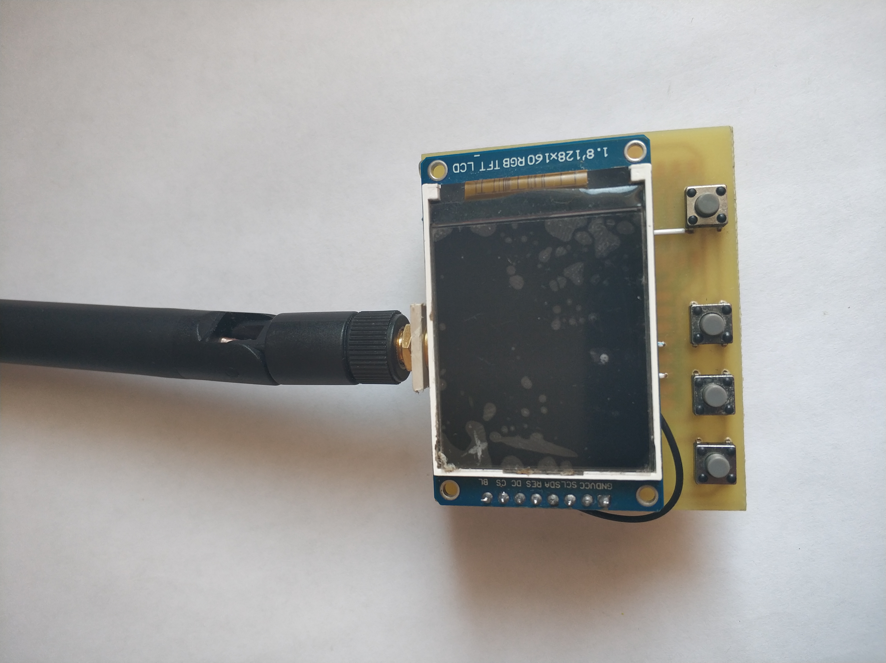
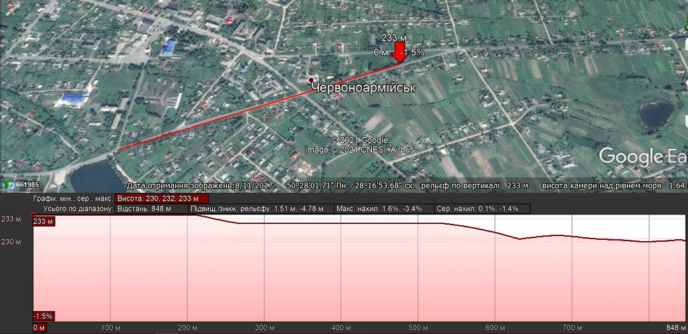
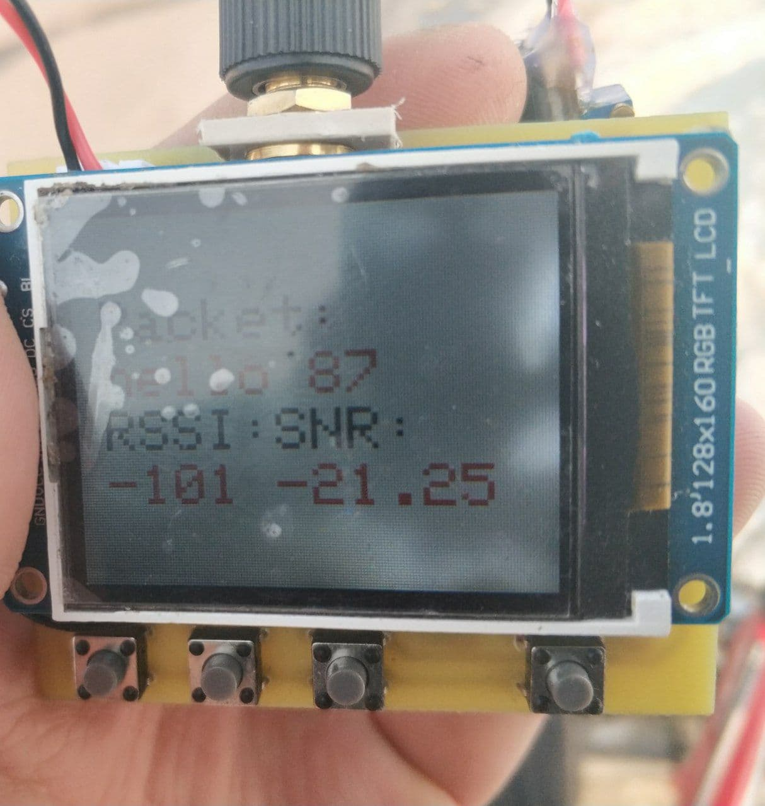
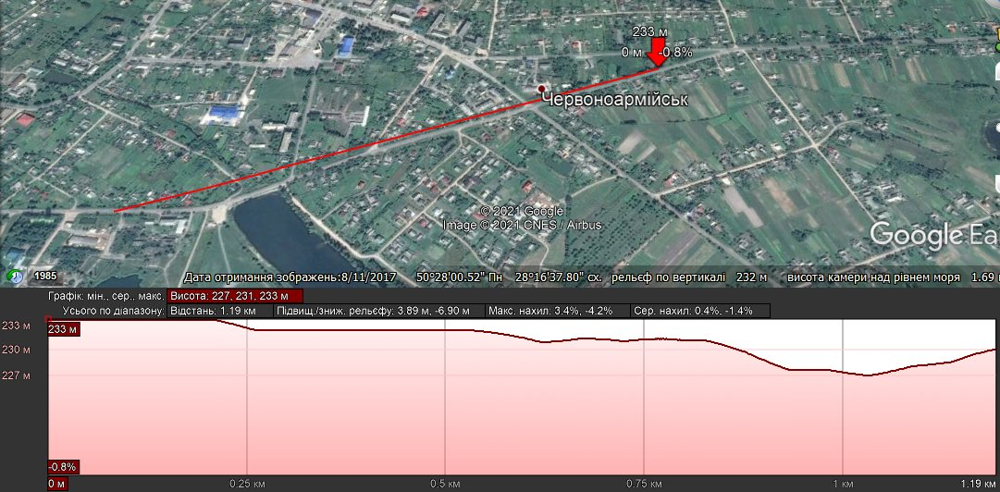
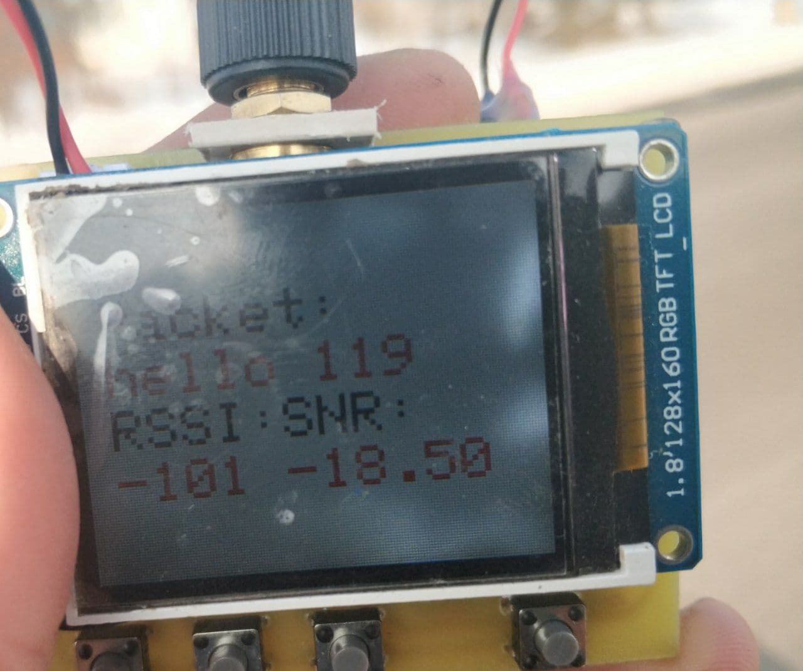
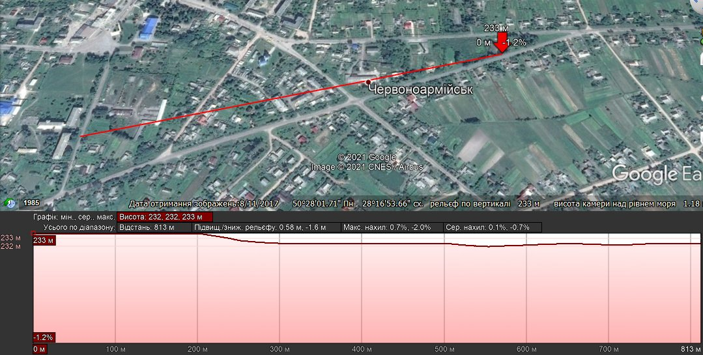
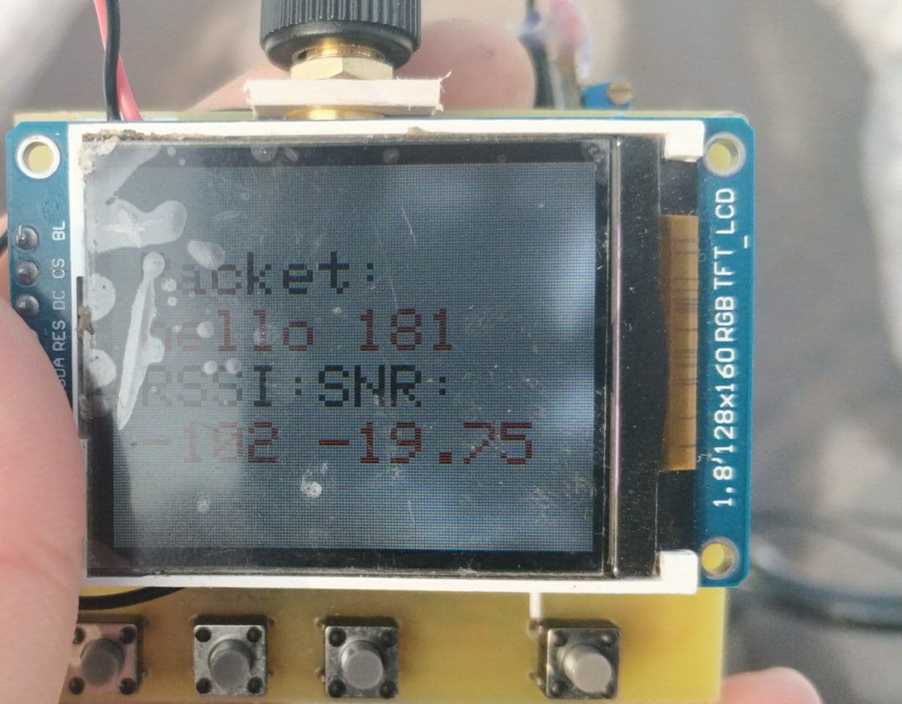

# man-made-accidents
# Система попередження техногенних аварій

Коди програм приймача та передавача системи містяться в папці *[old_diploma_code](https://github.com/Portia-Lin/man-made-accidents/tree/master/old_diploma_code)*.

Для тестування дальності було розроблено нові прилади та написані нові програми.
Нові коди для тестування дальності містяться в папці *[new_test_code](https://github.com/Portia-Lin/man-made-accidents/tree/master/new_test_code)*. 
Також є фото придалів у папці *[images/photos](https://github.com/Portia-Lin/man-made-accidents/tree/master/images/photos)*. 
Електричні принципові схеми містяться у папці *[images/wiring_diagram](https://github.com/Portia-Lin/man-made-accidents/tree/master/images/wiring_diagram)* в форматі PDF.

### Фото передавача:

### Фото приймача:

Було протестовано дальність роботи. Максимальна дальність становить:

**Перше вимірювання дальності роботи:**

**Друге вимірювання дальності роботи:**

**Третє вимірювання дальності роботи:**

